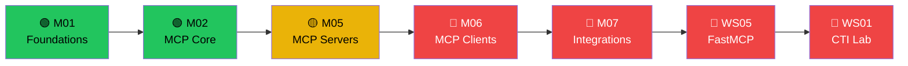
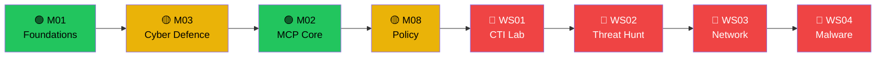
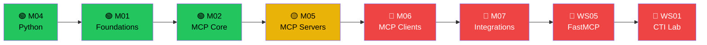

# RAISEGUARD Academy — Course Flow Strategy Guide

> **How to use this guide:** This document maps the full curriculum, classifies every module and workshop by difficulty, and proposes four learner pathways. Use the flow graphs to plan your learning journey. The NotebookLM prompt at the end generates professional slide decks for any pathway.

---

## 1. Curriculum Overview

| # | Module / Workshop | Difficulty | Duration | Prerequisites |
|---|---|---|---|---|
| M01 | Agentic AI Foundations | 🟢 Beginner | ~4 h | None |
| M02 | MCP Fundamentals | 🟢 Beginner | ~5 h | M01 |
| M03 | Cyber Defence Foundations | 🟡 Intermediate | ~6 h | M01 |
| M04 | Python Essentials for MCP | 🟢 Beginner | ~4 h | None |
| M05 | Building MCP Servers | 🟡 Intermediate | ~8 h | M02, M04 |
| M06 | Building MCP Clients | 🔴 Advanced | ~8 h | M05 |
| M07 | MCP Integrations | 🔴 Advanced | ~6 h | M05, M06 |
| M08 | Policy & Boundaries | 🟡 Intermediate | ~4 h | M01, M03 |
| WS01 | CTI Automation Workshop | 🔴 Advanced | ~3 h | M05, M06 |
| WS02 | Threat Hunting Workshop | 🔴 Advanced | ~3 h | M05, WS01 |
| WS03 | Network Analysis Workshop | 🔴 Advanced | ~3 h | M05, WS01 |
| WS04 | Malware Analysis Workshop | 🔴 Advanced | ~3 h | M05, WS01 |
| WS05 | FastMCP Deploy Workshop | 🔴 Advanced | ~3 h | M06, M07 |

---

## 2. Module Descriptions & Key Lessons

### 🟢 M01 — Agentic AI Foundations
Core mental models for AI agents. Covers the Sense-Think-Act loop, memory and goal management, agent orchestration patterns, and the automation decision matrix that governs when MCP agents may act autonomously.

**Key lessons:** What Is an Agent · The Sense-Think-Act Loop · Memory, Goals & State · Orchestration Patterns · Automation Decision Matrix

---

### 🟢 M02 — MCP Fundamentals
The architecture and communication layers of the Model Context Protocol. Covers the JSON-RPC transport, tool/resource/prompt primitives, and the MCP ecosystem landscape.

**Key lessons:** Why MCP Exists · Core Architecture · Communication Layers · Local vs Remote Servers · The MCP Ecosystem

---

### 🟡 M03 — Cyber Defence Foundations
SOC workflows, triage phases, and workstream mapping. Students build a mental model of where MCP agents can accelerate defensive operations — from enrichment through containment.

**Key lessons:** SOC Workflow Mapping · Cyber Defence Workstreams · Real-World MCP Servers · CTI Enrichment Chain · Malware Triage Walkthrough

---

### 🟢 M04 — Python Essentials for MCP
Targeted Python skills needed to write MCP tools: type hints, docstrings, data structures, JSON handling, and error validation. Designed for students with zero Python background.

**Key lessons:** Python Basics · Data Structures & JSON · Type Hints & Docstrings · Error Handling & Validation

---

### 🟡 M05 — Building MCP Servers
Hands-on server construction using FastMCP and raw protocol. Covers tool design, resource endpoints, prompt templates, and server deployment patterns.

**Key lessons:** FastMCP Foundations · Tool Architecture · Resources & Prompts Design · Multi-Tool Servers · Deployment Patterns

---

### 🔴 M06 — Building MCP Clients
Autonomous agent clients that call MCP servers. Covers asynchronous Python clients, multi-step reasoning loops, and integration with LLM backends.

**Key lessons:** Client Architecture · Async MCP Client · Autonomous Triage Agent · Multi-Server Orchestration

---

### 🔴 M07 — MCP Integrations
End-to-end integration: connecting MCP servers to SOC toolchains (SIEM, EDR, threat intel platforms), authentication patterns, and production deployment.

**Key lessons:** Integration Architecture · SIEM & EDR Connectors · Authentication & Security · Production Deployment

---

### 🟡 M08 — Policy & Boundaries
Governance layer: when to automate, when to require human approval, and how to set guardrails for MCP agents in production SOC environments.

**Key lessons:** The Autonomy Matrix · Guardrails Design · Policy Enforcement · Knowledge Check

---

### 🔴 WS01–WS05 — Hands-On Workshops
Capstone lab exercises using Jupyter Notebooks on Google Colab. Each workshop applies the full MCP stack to a real SOC scenario.

| Workshop | Scenario |
|---|---|
| WS01 | CTI Automation — Automate IOC enrichment with a live MCP agent |
| WS02 | Threat Hunting — Build a behavioural hunt across SIEM logs |
| WS03 | Network Analysis — Passive network triage with MCP tools |
| WS04 | Malware Analysis — YARA + sandbox integration via MCP |
| WS05 | FastMCP Deploy — Deploy a production-ready MCP server |

---

## 3. Learning Pathway Strategies

Four recommended pathways depending on student background and goal.

---

### 🚀 Path A — "Complete Foundations" *(Recommended for most learners)*
*Best for:* Security professionals new to AI and MCP  
*Duration:* ~48 hours over 8–10 weeks

```
M01 → M02 → M03 → M04 → M05 → M08 → M06 → M07 → WS01 → WS02 → WS03 → WS04 → WS05
```

---

### ⚡ Path B — "Fast Track" *(Developer / Python-experienced)*
*Best for:* Developers who already know Python and want to build MCP tooling fast  
*Duration:* ~28 hours over 4–5 weeks

```
M01 → M02 → M05 → M06 → M07 → WS05 → WS01
```
*Skip:* M03 (optional later), M04 (if Python-fluent), M08 (revisit after WS01)

---

### 🛡️ Path C — "SOC Analyst Track" *(Defensive security focus)*
*Best for:* SOC analysts who want AI-augmented triage skills without deep coding  
*Duration:* ~32 hours over 5–6 weeks

```
M01 → M03 → M02 → M08 → WS01 → WS02 → WS03 → WS04
```
*Skip:* M04 (Python), M06–M07 (client/integration dev)

---

### 🐍 Path D — "Python Developer Track" *(MCP tool builder)*
*Best for:* Python developers building custom MCP servers and clients  
*Duration:* ~36 hours over 6–7 weeks

```
M04 → M01 → M02 → M05 → M06 → M07 → WS05 → WS01
```
*Skip:* M03, M08 (optionally revisit for governance context)

---

## 4. Flow Graphs

### Path A — Complete Foundations

```mermaid
flowchart LR
    M01["🟢 M01\nAgentic AI\nFoundations"] --> M02["🟢 M02\nMCP\nFundamentals"]
    M02 --> M03["🟡 M03\nCyber Defence\nFoundations"]
    M03 --> M04["🟢 M04\nPython\nEssentials"]
    M04 --> M05["🟡 M05\nBuilding MCP\nServers"]
    M05 --> M08["🟡 M08\nPolicy &\nBoundaries"]
    M08 --> M06["🔴 M06\nBuilding MCP\nClients"]
    M06 --> M07["🔴 M07\nMCP\nIntegrations"]
    M07 --> WS01["🔴 WS01\nCTI\nAutomation"]
    WS01 --> WS02["🔴 WS02\nThreat\nHunting"]
    WS02 --> WS03["🔴 WS03\nNetwork\nAnalysis"]
    WS03 --> WS04["🔴 WS04\nMalware\nAnalysis"]
    WS04 --> WS05["🔴 WS05\nFastMCP\nDeploy"]

    style M01 fill:#22c55e,color:#000
    style M02 fill:#22c55e,color:#000
    style M04 fill:#22c55e,color:#000
    style M03 fill:#eab308,color:#000
    style M05 fill:#eab308,color:#000
    style M08 fill:#eab308,color:#000
    style M06 fill:#ef4444,color:#fff
    style M07 fill:#ef4444,color:#fff
    style WS01 fill:#ef4444,color:#fff
    style WS02 fill:#ef4444,color:#fff
    style WS03 fill:#ef4444,color:#fff
    style WS04 fill:#ef4444,color:#fff
    style WS05 fill:#ef4444,color:#fff
```



---

### Path B — Fast Track



---

### Path C — SOC Analyst Track



---

### Path D — Python Developer Track



---

## 5. NotebookLM Prompt — Course Flow Strategy Slide Deck

> Copy and paste this prompt into **NotebookLM** after uploading all `Module_XX_Content.md` files and this document as sources.

---

**NOTEBOOKLM SLIDE GENERATION PROMPT:**

```
You are a professional course designer and slide deck creator for RAISEGUARD Academy, a cybersecurity AI training programme.

Using the uploaded course content files and this Course Flow Strategy Guide, generate a professional slide deck for presenting the full course structure and learning pathways to prospective students.

## Slide Deck Structure

SLIDE 01 — TITLE SLIDE
- Title: "RAISEGUARD Academy — Your Path to AI-Powered Cyber Defence"
- Subtitle: "13 Modules & Workshops · 4 Learning Pathways · Hands-On Labs"
- Visual: A dark, cinematic cybersecurity aesthetic

SLIDE 02 — THE PROBLEM WE SOLVE
- Headline: "SOC teams are overwhelmed. AI agents can help — if used correctly."
- 3 bullet points covering: volume of alerts, speed requirements, and the risk of unsupervised automation
- Visual: Simple alert queue diagram

SLIDE 03 — WHAT YOU WILL BUILD
- Headline: "By the end of this course, you will build a working AI-powered SOC tool."
- 4 outcomes: design agents, build MCP servers, deploy them, govern them safely
- Visual: MCP architecture diagram

SLIDE 04 — THE CURRICULUM MAP
- Full table: Module name, difficulty (Beginner🟢/Intermediate🟡/Advanced🔴), estimated hours
- Source: Section 1 of the Course Flow Strategy Guide

SLIDE 05 — PATH A: COMPLETE FOUNDATIONS
- Headline: "The Full Journey: 48 hours, 8–10 weeks"
- Flow: M01 → M02 → M03 → M04 → M05 → M08 → M06 → M07 → WS01–WS05
- Best for: Security professionals new to AI
- Visual: Linear flow diagram with colour-coded difficulty

SLIDE 06 — PATH B: FAST TRACK
- Headline: "Already Know Python? Fast-Track to Production"
- Flow: M01 → M02 → M05 → M06 → M07 → WS05 → WS01
- Best for: Developers who want to ship quickly
- Visual: Compact 7-step flow diagram

SLIDE 07 — PATH C: SOC ANALYST TRACK
- Headline: "Build AI-Augmented Triage Skills Without Deep Coding"
- Flow: M01 → M03 → M02 → M08 → WS01 → WS02 → WS03 → WS04
- Best for: Analysts who need AI tools, not AI development skills
- Visual: SOC-themed flow diagram

SLIDE 08 — PATH D: PYTHON DEVELOPER TRACK
- Headline: "Build Custom MCP Servers and Clients from Scratch"
- Flow: M04 → M01 → M02 → M05 → M06 → M07 → WS05 → WS01
- Best for: Python developers building security tooling
- Visual: Developer-themed flow diagram

SLIDE 09 — THE WORKSHOPS: WHERE IT ALL COMES TOGETHER
- 5 workshops in a grid layout: title, scenario, duration
- Emphasise: "Real tools. Real SOC data simulations. Google Colab."

SLIDE 10 — HOW TO CHOOSE YOUR PATH
- Decision tree:
  "Are you a Python developer?" → YES: Path D or B. NO → "Are you a SOC analyst?" → YES: Path C. NO → Path A
- Visual: Simple decision tree diagram

SLIDE 11 — WHAT'S NEXT
- Call to action: Log in → Choose your path → Start Module 01
- 3 icons: 🔐 Login · 🗺️ Pick a Path · 🚀 Start Learning

## Formatting Requirements
- Dark background (#0a0e1a) with cyan/electric blue (#00d4ff) accent colour
- Bold, high-contrast typography (Inter or Outfit font family)
- Each slide must have a prominent visual or diagram — no text-only slides
- Code snippets use a dark syntax-highlighted code block
- Bullet points max 5 per slide
- Professional cybersecurity brand aesthetic throughout
```

---

## 6. Quick Reference — Difficulty Legend

| Icon | Label | Description |
|---|---|---|
| 🟢 | **Beginner** | No prior AI or Python knowledge required |
| 🟡 | **Intermediate** | Requires M01–M02 and basic Python familiarity |
| 🔴 | **Advanced** | Requires MCP server knowledge and async Python |
